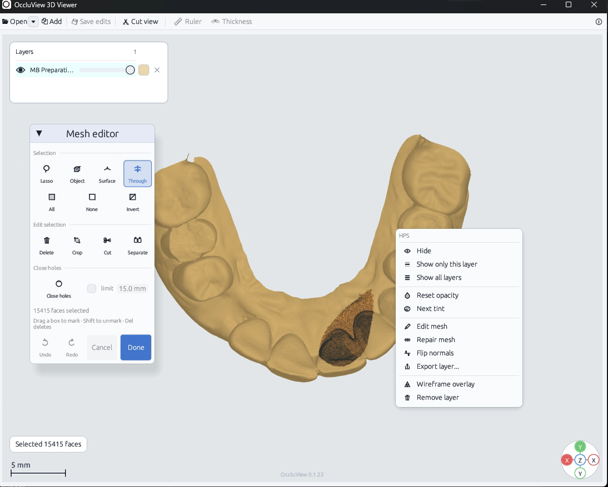

<p align="center">
  
</p>

<h1 align="center">OccluView</h1>

<p align="center">A fast native 3D viewer for dental scans and mesh files.</p>

<p align="center">
  
</p>

OccluView opens large 3D files quickly and keeps the workspace focused on the
model. It supports multiple layers, measurement tools, basic mesh editing,
Windows Explorer integration, and a native Linux package.

## Features

- Orthographic 3D viewport with orbit, pan, cut view, ruler, and thickness measurement.
- Multiple layers with visibility, opacity, tint, and wireframe controls.
- Selection by click, rectangle, or lasso.
- Mesh editing with delete, crop, cut, separate, close holes, repair, smooth, and undo/redo.
- Windows thumbnails, Preview Pane, file associations, and context-menu integration.
- Linux desktop integration with MIME registration and a thumbnailer.

<p align="center">
  
</p>

## Supported formats

- `.stl` - binary and ASCII meshes
- `.ply` - binary and ASCII meshes with vertex colors
- `.obj` - meshes and vertex colors
- `.glb` - meshes with embedded textures
- `.hps` and `.dcm` - HPS mesh containers

## Download

[Download the latest release](https://github.com/occlutrace/OccluView/releases/latest)

The release page contains the Windows installer, portable Windows archive,
Debian package, and SHA-256 checksums.

## Windows

The MSI installs the viewer together with Explorer thumbnails, Preview Pane
support, file associations, and the shared 3D-object icon. Opening another
file while the viewer is running adds it to the current scene.

## Linux

The Debian package installs the viewer, desktop entry, MIME registration,
icon, and thumbnailer.

## Build from source

```bash
cargo fmt --all --check
cargo clippy --workspace --all-targets -- -D warnings
cargo test --workspace --all-targets
cargo run -p occluview-app --release -- path/to/scan.stl
```

## License

Apache-2.0. See [LICENSE](LICENSE).

---

OccluTrace
